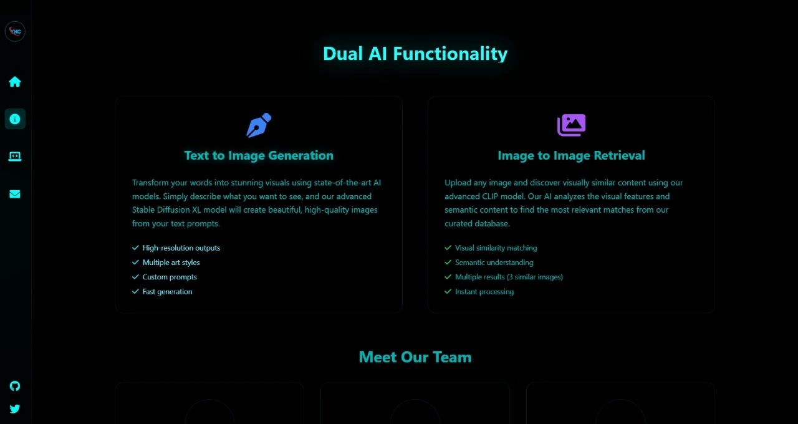
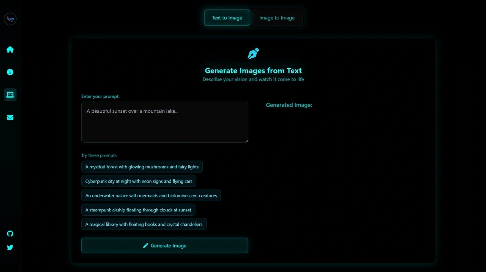
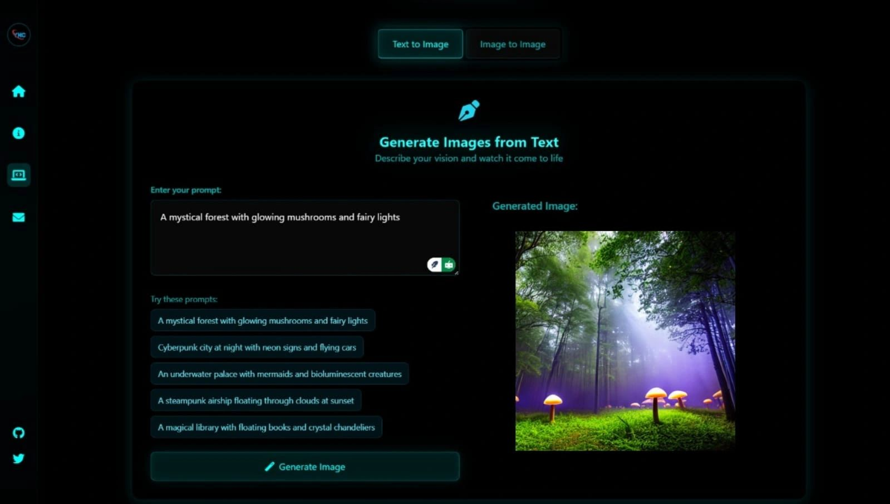
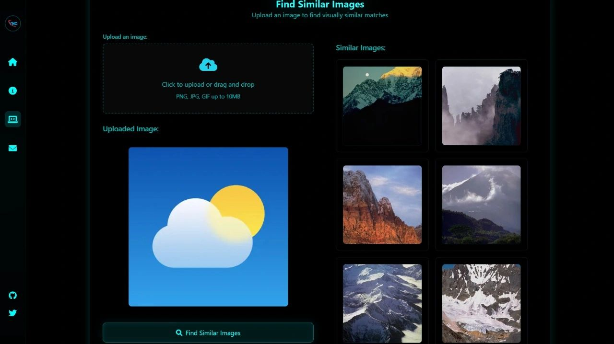

# DB6 — Frontend Overview

A clear, professional README for the frontend of the DB6 project. This file documents the folder structure, explains the important files, and displays the frontend screenshots located in `Frontend/Images`.

---

## Table of contents
- [Project Structure](#project-structure)
- [How to run (Frontend)](#how-to-run-frontend)
- [Folder & file explanations](#folder--file-explanations)
- [Frontend Screenshots](#frontend-screenshots)
- [Updating the gallery](#updating-the-gallery)
- [Notes](#notes)

---

## Project Structure
- 🗂️ Source Code
  - 🖥️ Frontend
    - 🖼️ Frontend/Images/ — frontend screenshots and UI assets (displayed below)
    - 🧠 Frontend/Model/ — model artifacts referenced by the frontend
    - 🧰 Frontend/static/
      - script.js — client-side JavaScript
      - style.css — styling for the UI
      - .gitkeep — directory placeholder
    - 📄 Frontend/templates/ — HTML/Jinja templates
    - 📄 Frontend/app.py — server entrypoint (Flask example)
    - 📄 Frontend/requirements.txt — Python dependencies

---

## How to run (Frontend)
1. Create and activate a virtual environment:
   - python3 -m venv .venv
   - source .venv/bin/activate  (macOS / Linux) or .venv\Scripts\activate (Windows)
2. Install dependencies:
   - pip install -r Frontend/requirements.txt
3. Start the app:
   - cd Frontend
   - python app.py
4. Open the address printed by the server (commonly http://127.0.0.1:5000).

---

## Folder & file explanations
- Frontend/Images — UI screenshots and assets used in the README and documentation.
- Frontend/Model — serialized models or weights used by the front-end (if any).
- Frontend/static — CSS and JS files for the frontend.
- Frontend/templates — HTML templates used to render pages.
- app.py — entrypoint to run the local frontend server.

---

## Frontend Screenshots

Below are all images currently in `Frontend/Images`. Each image is shown as a preview and links to the full file.

  
  &nbsp;&nbsp;
  

  
  &nbsp;&nbsp;
  

  

Captions:
- 1.jpg — screenshot 1
- 2.jpg — screenshot 2
- 3.jpg — screenshot 3
- 4.jpg — screenshot 4
- 5.jpg — screenshot 5

---

## Updating the gallery
To add or remove images from this gallery:
- Add the image files to `Frontend/Images/` with descriptive filenames.
- Commit the new files to the repository.
- The images will automatically appear here (GitHub renders files referenced by relative paths).  
If you prefer automatic insertion into a marker block, I can provide a small generator script that writes the image list into the README between markers.

---

## Notes
- Prefer descriptive filenames (e.g., `login-page.png`, `dashboard-annotated.jpg`) to make captions meaningful.
- Optimize large images for web to keep the README loading fast.
- If any image should not appear here, remove it from `Frontend/Images` or rename it.

---
